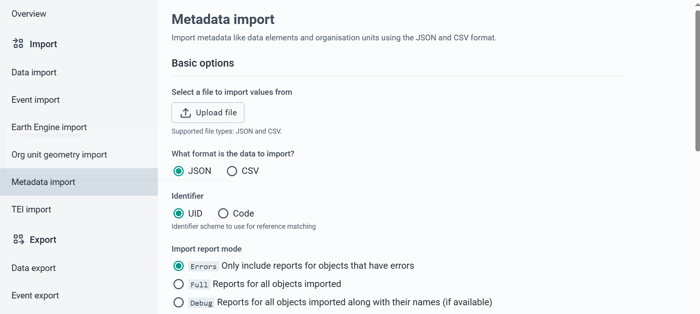

# Early_warning_system_ETL

## About the Project
En este proyecto se presenta una Demo, la cual muestra como ejemplo un proceso ETL en el utilizamos a ```GNU-Health``` como origen de datos y ```DHIS2``` como destino

## Notas
Este repositorio tiene como origen dos servidores de GNU-Health distintos los cuales pretenden simular los datos de varios Faculties
- faculty1: Hospital_Adeje
- faculty2: sanitary_center_Adeje

## Entorno
#### Antes de comenzar con el codigo es necesario tener instalado Docker.
#### Todos los script esta creado con Python 3.9.

Las la version de librerias utilizadas fueron ultimas que se encuentran actualmente:

- Proteus 
- Pandas 
- Faker 
- Requests
- Collections
- Datetime
- Json

## Getting Started
Para comenzar a usar esta demo necesitamos crear imagenes del cliente de ```GNU-Health Client```, servidor Tryton, Base de datos Postgres y DHIS2.


Para construir la imagen del **Servidor Tryton** se introducira la siguiente sentencia :

```bash
docker build -t opendx/gnu_health https://github.com/OpenDx28/gnu-health-server-docker.git#new_demo
```

**Interfaz Gráfica GNU Health** consta de 2 pasos :

```bash
1. docker build -t vnc-base https://github.com/OpenDx28/docker-vnc-base.git#:sr

2. docker build -t gnu-hc --build-arg BASE_IMAGE="vnc-base:latest" https://github.com/OpenDx28/docker-gnu-hc.git#:src
```

Base de datos **Postgres**: 

Esta imagen se descargará automáticamente más adelante al ejecutar el docker-compose up -d.

Para levantar la imagen de **DHIS2** tenemos que clonar el repositorio que adjunto a continuación:

``` bash 
https://github.com/paulavmf/opendx_course/tree/master/dhis2
```

Contenedor_etl:

Tenemos un fichero dockerfile el cual levantara una imagen de nuestro contenedor con todos nuestros script y csv:

para construirla utilizaremos:

```bash 
docker build -t etl .
```

Una vez tengamos todas las imagenes y el repositorio de DHIS2, Se procedera a lanzar el comando siguiente el cual levantara todo el ecosistema que necesitamos

```bash
docker-compose up -d
```

Con todo levantado deberían estar esos contenedores(Gnuclient, 2 servidores de tryton, container_etl y dhis2) levantados y acceder a las interfaces de los sistemas gnu client y DHIS2.

Desde el propio docker desktop de windows tenemos una opción para arrancar y apagar el compose que tenemos, desde ahí nos metemos en cada uno de ellos y podemos clickar en un enlace que nos abrirá las interfaces mencionadas anteriormente.

credenciales:

```
gnu-client
■ user: admin
■ pass: gnusolidario
```
```
Dhis2
■ user: admin
■ pass: district
```

## Container_etl
### Conexiones
En nuestro container tenemos un csv llamado datacon.csv en el cual esta toda la inforamcion sobre la conexion a nuestro server de tryton y DHIS2


### DHIS2
Puede ocurrir que se necesite meter el metadata de dhis2 una vez recien levantado el container, entonces deberiamos de entrar en dhis2 e insertar los ficheros que tenemos en al carpeta
metadata e introducirlo en su orden.

En el panel de la derecha debemos buscar Import/export y clicamos


una vez dentro en el apartado de metadata import, no saldrá una ventana como esta, ahora debemos ir selecionando los ficheros uno a uno y dandole a upload file



Cuando hayamos terminado podremso observar que se cargar varios dashboard y tenemos algunos dataset,orgunit,dataelement,etc...
